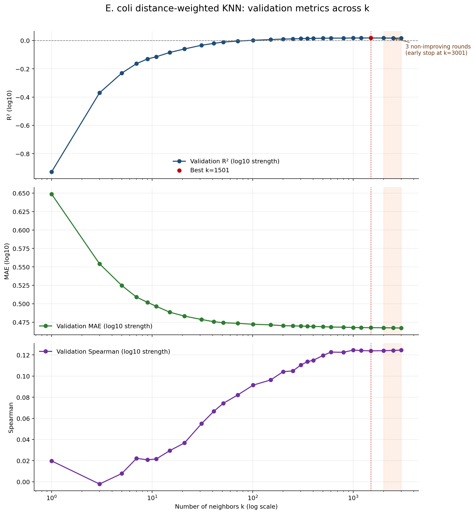
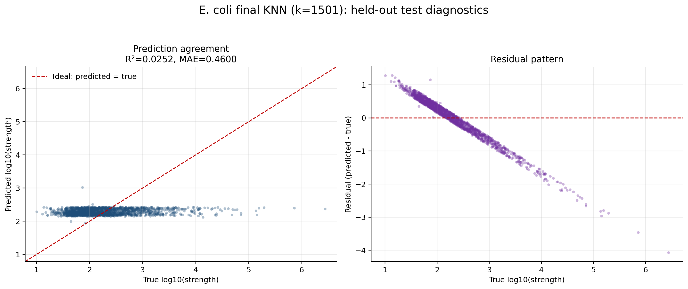

# E. coli 完整 KNN 实验报告

## 实验设计

- 样本：11,884 条 E. coli 50 bp 启动子序列。
- 特征：8 类理化特征；StandardScaler 只在训练数据上拟合。
- 目标：`target_log10 = log10(strength)`。
- 固定划分：train=8,318，val=1,783，test=1,783。
- 模型：距离加权欧氏距离 KNN 回归。
- 超参数：按 `k=[1, 3, 5, 7, 9, 11, 15, 21, 31, 41, 51, 71, 101, 151, 201, 251, 301, 351, 401, 501, 601, 801, 1001, 1201, 1501, 2001, 2501, 3001, 4001, 5001]` 顺序搜索，监控 val 的 log10 R²。
- 早停：连续 3 轮无提升后停止；本次执行 28 轮，停止原因是 `early_stopping_patience_3`。
- 最优 `k`：1501。

## 结果

| 子集 | 拟合数据 | log10 R² | log10 MAE | log10 Spearman | raw R² | raw MAE | coverage |
|---|---|---:|---:|---:|---:|---:|---:|
| val | train | 0.017922 | 0.467528 | 0.123869 | -0.012184 | 1401.476933 | 1.0 |
| test | train + val | 0.025224 | 0.460037 | 0.164439 | -0.001924 | 3141.619077 | 1.0 |

## k 搜索与早停分析

实际评估了 28 个 k，主选择指标是验证集 `log10 R²`。完整逐轮记录见 `hyperparameter_search.csv`。

| k | val R² | val MAE | val Spearman | 状态 |
|---:|---:|---:|---:|---|
| 1 | -0.929486 | 0.648770 | 0.019754 | 提升 |
| 3 | -0.369907 | 0.554187 | -0.002170 | 提升 |
| 5 | -0.230239 | 0.524675 | 0.007805 | 提升 |
| 7 | -0.163453 | 0.508984 | 0.022099 | 提升 |
| 9 | -0.130397 | 0.501891 | 0.020780 | 提升 |
| 11 | -0.114888 | 0.496531 | 0.021551 | 提升 |
| 15 | -0.084383 | 0.488524 | 0.029481 | 提升 |
| 21 | -0.059837 | 0.483232 | 0.036741 | 提升 |
| 31 | -0.033451 | 0.478689 | 0.054937 | 提升 |
| 41 | -0.020430 | 0.475652 | 0.066607 | 提升 |
| 51 | -0.010957 | 0.474260 | 0.074202 | 提升 |
| 71 | -0.003901 | 0.473442 | 0.082113 | 提升 |
| 101 | 0.001461 | 0.472205 | 0.091412 | 提升 |
| 151 | 0.006596 | 0.471399 | 0.096353 | 提升 |
| 201 | 0.010123 | 0.470211 | 0.104167 | 提升 |
| 251 | 0.011276 | 0.470041 | 0.104877 | 提升 |
| 301 | 0.013481 | 0.469725 | 0.110413 | 提升 |
| 351 | 0.014466 | 0.469455 | 0.113713 | 提升 |
| 401 | 0.015184 | 0.469286 | 0.114897 | 提升 |
| 501 | 0.016271 | 0.468907 | 0.119540 | 提升 |
| 601 | 0.016994 | 0.468427 | 0.122709 | 提升 |
| 801 | 0.017086 | 0.468223 | 0.122491 | 提升 |
| 1001 | 0.017831 | 0.467751 | 0.124614 | 提升 |
| 1201 | 0.017893 | 0.467648 | 0.124143 | 提升 |
| 1501 | **0.017922** | 0.467528 | 0.123869 | **最佳 R²** |
| 2001 | 0.017431 | 0.467467 | 0.124034 | 未提升 1/3 |
| 2501 | 0.017148 | 0.467281 | 0.124259 | 未提升 2/3 |
| 3001 | 0.016902 | **0.467136** | 0.124611 | 未提升 3/3，早停 |

`k=1501` 是主指标 R² 的最佳值。若单独看已评估点的 MAE，最低值为 `k=3001`；若单独看 Spearman，最高值为 `k=1001`，但最终模型按预先确定的 R² 规则选择 `k=1501`。KNN 没有 epoch，这里的早停只是按 k 网格顺序停止超参数搜索；扩展到 `k=3001` 后连续三轮 R² 无提升，因此作为节省计算量的工程规则是合理的，但不能证明未评估的 k 不会偶然更好。

## 交付产物

- `knn_ecoli_full_config.json`：完整实验配置、输入哈希、搜索和早停记录。
- `hyperparameter_search.csv`：每轮 `k` 的验证集结果。
- `knn_ecoli_full_model.joblib`：使用 train+val 重拟合的最终模型和标准化器。
- `predictions_knn_ecoli_full_val.csv`、`predictions_knn_ecoli_full_test.csv`：完整 val/test 逐样本预测。
- `metrics_knn_ecoli_full.csv`：log10/raw 尺度的 R²、MAE、Spearman。
- `coverage_knn_ecoli_full.csv`：val/test 请求数、成功数和覆盖率。
- `common_eval_ids_knn_ecoli_full.tsv`：完整 test 评估样本 ID。

本实验是完整 E. coli KNN 回归基线；其它分类任务不并入本回归实验。
