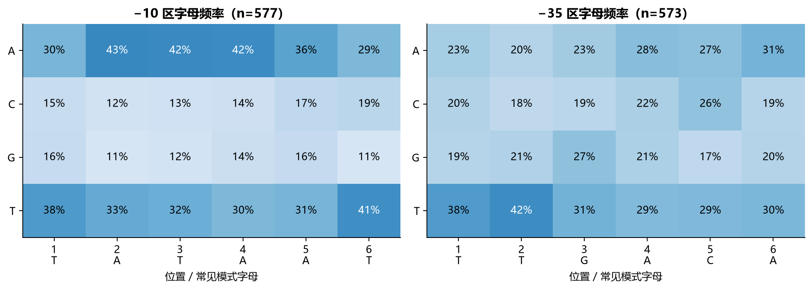
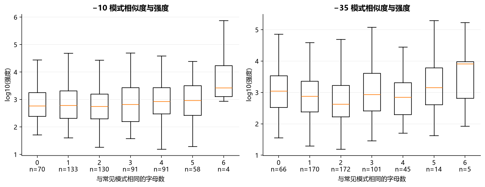
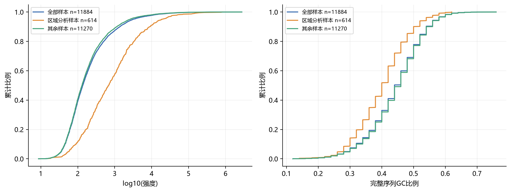

# 启动子区域特征与强度关系

日期：2026-10-05。

## 主要发现

−10 区表现出明显的 A/T 富集：A/T 比例为 71.5%，同批完整序列为 59.6%。−35 区的前两个位置偏向 T，其余位置的字母偏好较弱。

区域 GC 比例与简单模式相似度对强度的解释有限，整体没有明显的单调关系。天然启动子中 −10 特征较明显、−35 特征较弱的现象，与原始研究相符。区域功能涉及多个因素，不能由简单相关性概括。[天然启动子研究](https://pmc.ncbi.nlm.nih.gov/articles/PMC4288677/)、[区域组合与强度实验](https://pmc.ncbi.nlm.nih.gov/articles/PMC9440211/)

## 区域统计

| 区域 | 分析样本数 | GC 与强度的相关性 |
| --- | ---: | ---: |
| −10 | 577 | -0.0634 |
| −35 | 573 | 0.0546 |
| 间隔 | 614 | -0.0010 |
| 上游区域 | 6 | -0.3189 |
| 参考起始位置 | 300 | 0.0539 |

| 常见模式 | 样本数 | 相似度与强度的相关性 |
| --- | ---: | ---: |
| −35 TTGACA | 573 | -0.0134 |
| −10 TATAAT | 577 | 0.0527 |

四项主要关系的重复抽样区间均跨过零，尚未观察到稳定的整体趋势。上游区域仅 6 条，保留统计值供复查。

## 图表

## 汇报表述

> 我们完成了启动子区域特征与强度的探索分析。−10 区呈现 A/T 富集，−35 区特征较弱，与天然启动子的部分已知特征相符。GC 比例和简单模式相似度不足以解释强度差异，后续将结合区域位置、间隔和多种特征进一步分析。

## 方法与数据范围

从全部 11,884 条 50 bp 强度序列中，614 条能在 81 bp 正样本中得到一致的位置和方向；其中 608 条只对应一条原始记录，6 条对应多条记录但换算位置相同。所有来源编号及各匹配位置保存在 match_audit.tsv。−10 分析 577 条，−35 分析 573 条。

采用 81 bp 窗口参考位置在第 61 位的布局约定：−35 和 −10 分别取六个字母，中间取 17 bp。位置由规则换算，annotations.tsv 使用 tool_inferred，并与外部确认注释分别计数。17 bp 是输入约定；本次没有测量真实间隔长度的分布。

区域分析样本的强度中位数为 678.11，全体为 137.09；这批样本偏向较高强度，结果不直接推广到全部序列。相关性使用 log10 强度与 Spearman 排序指标；区间使用样本行成对重抽样 4,000 次，未作相似序列分组修正。

## 复现与交接

源表位于 source_tables/；biological_summary.json 保留分布、区域特征和区间；region_coverage.json 保留覆盖统计。run_manifest.json 绑定输入与产物哈希、环境和上游提交，source_code/ 保存实际运行脚本。图表经实际查看后由 verify_run.py 记录视觉验收。

本次在 csy 上接入胡昊铭提交 3c779b9d07f369432604551b2b020287b224232d 的代码，并修正匹配来源、注释等级和汇报表达。
